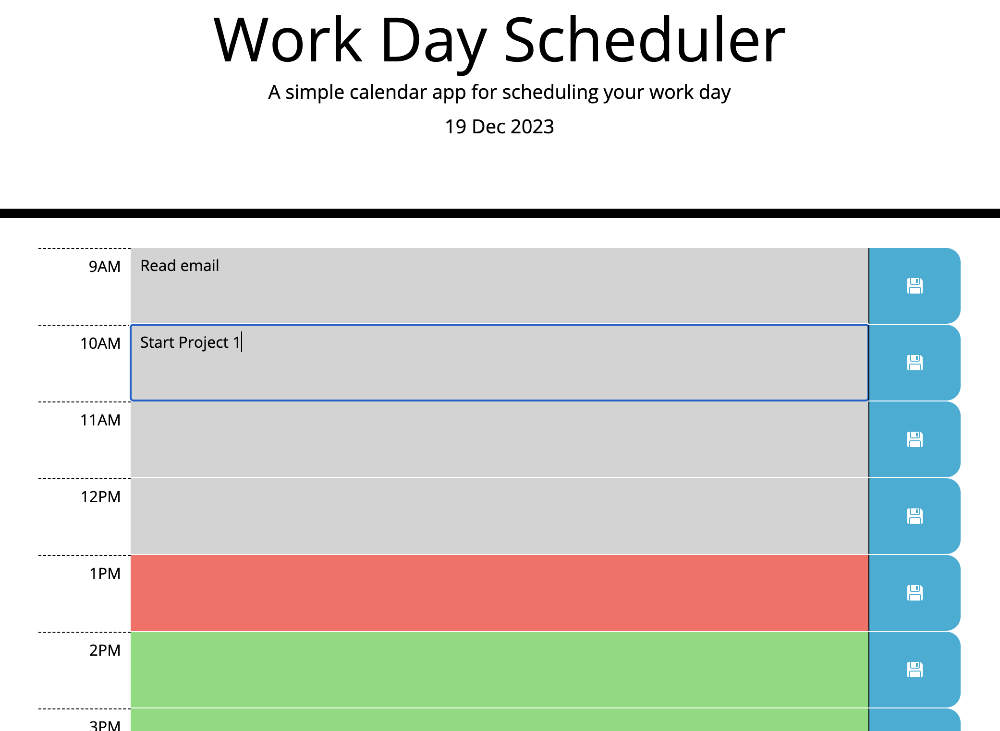

# Timed Quiz App

A daily scheduler built with jQuery, CSS and HTML, that allows user to:

- Display the current day at the top of the calendar when they open the planner.
- Present timeblocks for standard business hours when they scroll down.
- Color-code each timeblock based on past, present, and future when the timeblock is viewed.
- Enter an event when they click a timeblock.
- Save the event in local storage when the save button is clicked in that timeblock.
- Persist events between refreshes of a page.

# Note for reviewer

The brief doesn't explain what a timeblock is or should be. I've interpreted it as the section that contains the description as that made most sense to me from a usability perspective.

# Install

Download or clone files to your computer and open the filepath in a browser.

# Usage

Page should render as follows:

# Hosted

You can see a live version at https://philmanwithbeard.github.io/Work-Day-Scheduler/
